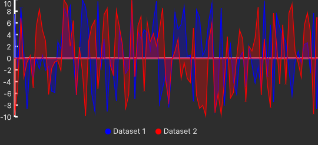
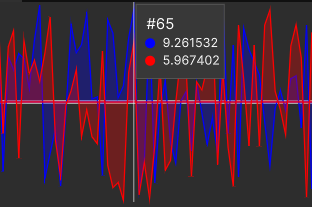
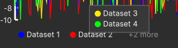

# Line Chart
The line chart is visual element which displays information as a series of data points connected by a straight line. It sohws changes in one or more variables over time.

A line chart is capable of showing one or more data providers.

!!! warning
    The data shown on the chart is shown by the order they are inserted in the data provider, not time, so the time passed between two data points is NOT reflected in the chart.

**API Reference**: [LineChart](../api/LineChart.md)

## Axis and Labels
The line chart is 2d chart having two axes. The horizontal axis shows the value and the vertical one shows the index of the data, ranging from 1 to the size of the data provider assigned to the chart with the bigget dataset.

The Y-axis is labeled, but the X-axis is not.

## Chart Tooltip
When mouse is hovered over the chart graph area, a box appears showing information about the closest data point to the mouse cursor, containing:
- The index of the data point.
- The value of that data point among all the data and their color indicator.
providers.

!!! note
    If a data provider doesn't have data with that index, it will show "No data" in the box next to its color indicator.

## Chart Legend
A legend appears in the bottom of the chart showing the color and the name of each data provider that is assigned to the line chart and found by the chart.

!!! note
    The order of the legend is determined by the order in which the data providers are defined in the `data-providers` attribute of the line chart.

If the legends don't fit, some of them will be hidden and there will be a "+n more" where n is the number of hidden legends. When the mouse is hoered over it the hidden legends will appear in a box.

