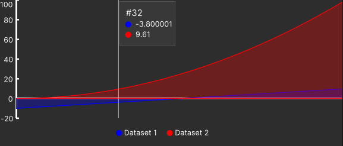

# UnityChart


UnityChart is a vector-based lightweight charting library for **Unity Editor tools**, fully compatible with **UI Toolkit**.
It helps you visualize data in real time, perfect for custom editors and inspectors, debugging tools, balancing interfaces, and more.

For API reference, guides, etc. please refer to the [Documentation](https://alirezaft.github.io/UnityChart/).

## Why UnityChart?

* 🟦 **Real-time data visualization** in editor windows
* 🛠️ **UI Toolkit–based**, works with UXML and USS
* 👨‍💻 Useful for developers tracking variables, performance metrics, or AI decisions
* 🎮 Helpful for game designers working on economy balancing, tuning stats, or monitoring game events

## Example

```cs title="ExampleMonoBehaviour.cs"
using UnityEngine;
using UnityChart.Runtime;
using Random = UnityEngine.Random;

public class Test : MonoBehaviour
{
    private DataProvider provider;

    private void Start()
    {
        provider = new DataProvider(Color.blue, "Test Provider", "provider");
    }

    private void Update()
    {
        provider.AddDataPoint(Random.value * 10);
    }
}
```

```xml title="ExampleWindow.uxml"
<ui:UXML xmlns:chart="UnityChart.Editor"
         xmlns:ui="UnityEngine.UIElements"
         xmlns:uie="UnityEditor.UIElements">

    <chart:LineChart data-providers="provider"/>

</ui:UXML>
```

## Limitations
* UnityChart can't handle `auto` for height and width values. If using auto for these values, you have to define a MinWidth and MinHeight for the chart visual element.
* UnityChart is designed for visualizing data generated in play mode for now. Using it to show data generated in the edit mode might lead to unexpected behavior and the loss of generated data after domain reload.
